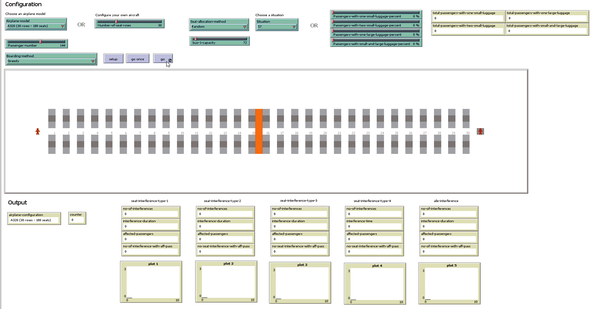
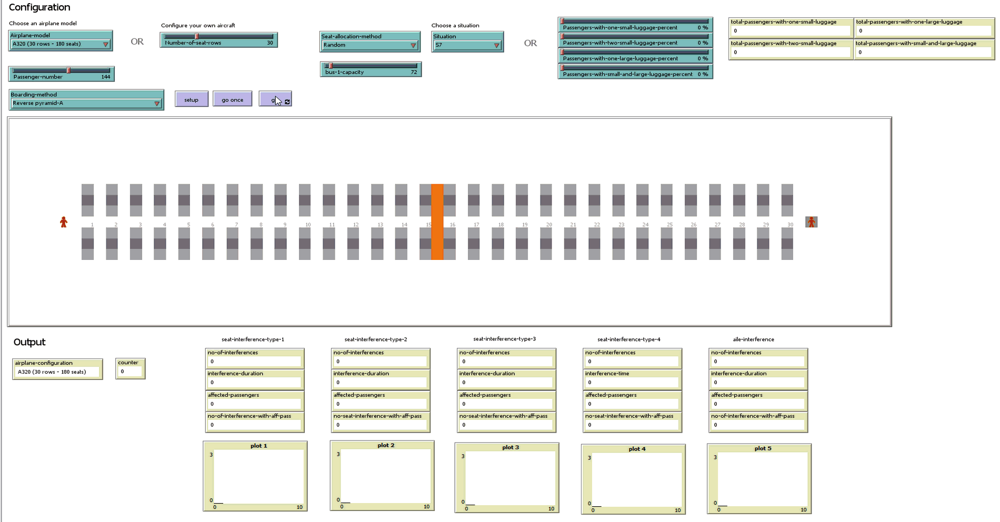
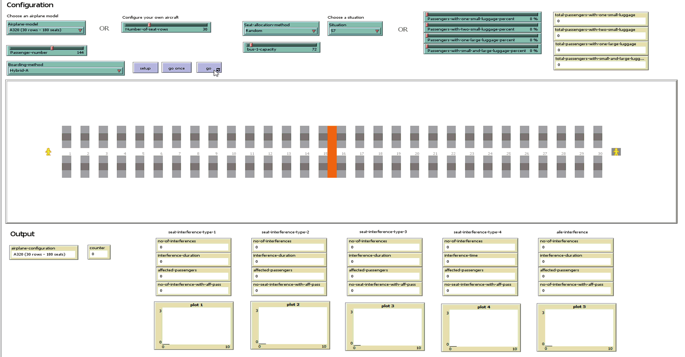
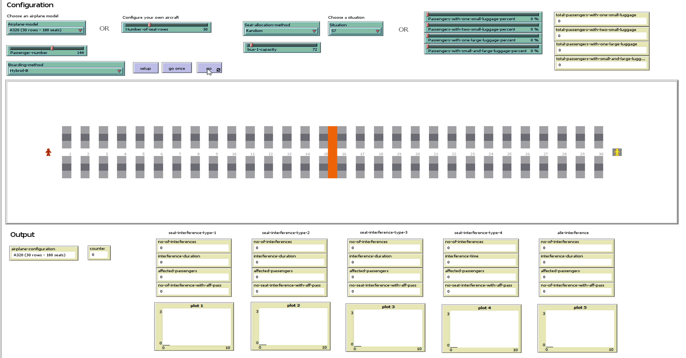

Please feel free to contact us at liviu.cotfas at ase .ro for the NetLogo source code. 

# Scenarios

All the simulations have been performed using the following settings:
- occupancy level: 80% (144 passengers);
- seat assignment: random seating;
- luggage situation: S7 (described in our paper).

> Suggestion: You can download the animations below in order to watch them at a higher resolution.

## Greedy

## Random

## Reverse pyramid-A

## Hybrid-A

## Hybrid-B
